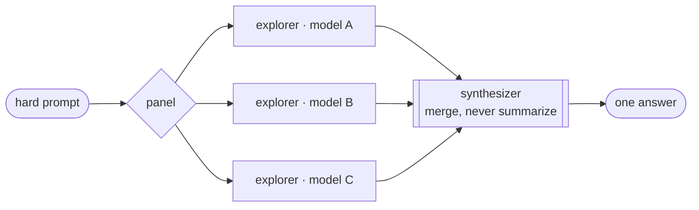

<div align="center">

# fusion
**A panel of models, one answer.**


Fan one hard prompt across many models in parallel as read-only explorers, then merge their
findings into a single answer — without losing any distinct point.

[](https://www.npmjs.com/package/@carson2222/fusion)
[](https://www.npmjs.com/package/@carson2222/fusion)
[](https://github.com/carson2222/fusion/stargazers)
[](LICENSE)

[Install](#install) · [How it works](#how-it-works) · [Configuration](#configuration) · [Cost](#cost--latency)

**An [OpenCode](https://opencode.ai) plugin. OpenCode-only for now.**

</div>

&nbsp;

One model misses things on hard problems — security audits, architecture calls, subtle bugs.
A panel of independent models, merged so no distinct finding is dropped, misses far fewer:
minority insights survive and disagreement is surfaced instead of averaged away.

Fusion is **read-only**. Explorers investigate — they never touch your files. You (or an agent)
act on the result. It's **provider-agnostic**: the panel is just `provider/model` strings, so it
rides whatever you already connected in OpenCode (subscriptions, local, OpenRouter…) — no metered
API of its own.

## How it works



Each panel model runs as its own child session — **parallel, blind to the others, read-only**.
A failed or hung explorer is skipped and reported; the rest continue. One synthesizer call then
merges every explorer's output into the final answer, keeping each distinct point and flagging
where they disagree. Raw per-explorer analyses stay in their child sessions, out of your main
context.

## Install

```jsonc
// ~/.config/opencode/opencode.json
{
  "$schema": "https://opencode.ai/config.json",
  "plugin": [
    ["@carson2222/fusion", {
      "panel": ["openai/gpt-5.5#high", "anthropic/claude-opus-4-8#max", "google/gemini-3-pro"]
    }]
  ]
}
```

Restart OpenCode after editing config. Every panel model must already be connected in OpenCode —
Fusion just uses the string.

## Use

- **Manually:** `/fusion <your hard task>` — read the merged answer, then decide: act, ask one
  model, or re-run. (Copy `command/fusion.md` into `~/.config/opencode/command/` to enable it.)
- **From an agent:** the `fusion` tool is in the registry; an agent can call it when it hits
  something genuinely hard.

The result carries a footer linking each explorer's child session — open one to read its full raw
analysis.

## Configuration

```jsonc
["@carson2222/fusion", {
  "panel": ["openai/gpt-5.5#high", "anthropic/claude-opus-4-8#max", "google/gemini-3-pro"],
  "synthesizer": "anthropic/claude-opus-4-8#max"   // optional; default = current session model
}]
```

- **`panel`** *(required)* — models that explore, as `provider/model` strings. **List length = how
  many explorers run.** Repeat a model to run it twice for self-consistency.
- **`#effort`** *(optional suffix)* — a reasoning variant the model exposes: `#high`, `#max`,
  `#xhigh`, `#minimal`, … No suffix = the model's default. An unknown value falls back to the
  default, so a typo degrades rather than breaks.
- **`synthesizer`** *(optional)* — the model that merges. Defaults to the model you're currently
  driving the session with.

<details>
<summary>Finding a model's effort levels</summary>

Effort levels are per-model reasoning variants OpenCode already knows about (e.g. OpenAI
`minimal…xhigh`, Anthropic `low…max`). List them for your connected models with
`client.config.providers()` → `provider.models[id].variants`, or check
[models.dev](https://models.dev). Models with no variants just run their default.

</details>

## Cost & latency

Fusion multiplies work on purpose: N explorers + 1 synthesizer, each a full model call. Cranking
`#effort` multiplies it again. A strong panel at max effort is genuinely expensive and slow per
run — that's the trade for catching what a single model misses. Use it for the hard problems, not
routine questions. Keep a cheap free-model panel for everyday use and swap to the strong one
deliberately.

## Behavior / limits (V1)

- Explorers are **read-only and parallel**, blind to each other.
- A failed or hung explorer is **skipped and reported**; the run continues on the rest.
- If synthesis itself fails, the raw explorer findings are returned instead — never a silent drop,
  never an automatic re-run of the expensive fan-out.
- No rounds, no orchestration, no persistence, no budgeting. On purpose — see `docs/design.md`.

## Development

```bash
bun install
bun run typecheck
bun probes/engine-test.ts     # end-to-end against a real server with free models
```

Design and verified SDK internals live in [`docs/`](docs/).

## License

MIT
